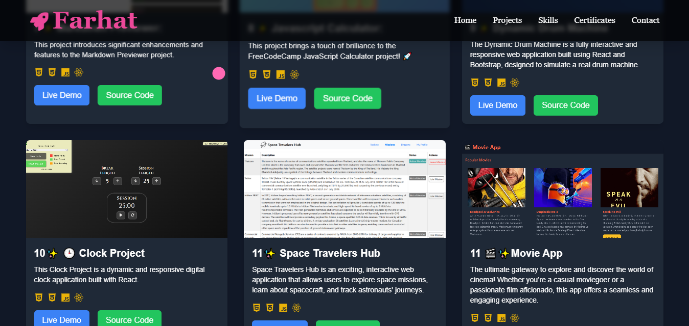

# 🌟 My Portfolio Project

Welcome to my **Portfolio Website**! This is a modern, responsive portfolio created using **React** and **Tailwind CSS**, designed to showcase my skills, projects, and achievements in web development. The project is fully interactive, visually engaging, and optimized for a seamless user experience.

---

## ✨ Key Features

- **🌐 Fully Responsive**: Optimized layout for desktop, tablet, and mobile devices.
- **⚛️ React Components**: Utilizes reusable and interactive components for a dynamic experience.
- **🎨 Tailwind CSS**: Customizable, utility-first CSS framework for clean and scalable design.
- **💨 Smooth Animations**: Animations powered by `animate.css` for a delightful user experience.
- **📂 Dynamic Project Showcase**: Presenting each project with its title, description, and images—viewable in a popup.
- **✉️ Contact Form**: Integrated with **Formspree**, styled with Tailwind CSS for smooth and easy contact submissions.
- **🔗 Social Media Links**: Access to my GitHub, LinkedIn, and other platforms via dynamic icons.
- **🛠 Skills Section**: Features a list of technical skills, each with an icon and highlighted with a dynamic arrow effect.
- **👨‍💻 About Me**: Personal details and a link to my FreeCodeCamp certifications.

---

## 🛠 Built With

<details>
  <summary>Languages & Tools</summary>
  <ul>
    <li>React</li>
    <li>Redux</li>
    <li>React Bootstrap</li>
    <li>Tailwind CSS</li>
    <li>Formspree</li>
    <li>Animate.css</li>
  </ul>
</details>

---

## 📦 Installation

To run this project locally, follow the steps below:

1. **Clone the Repository**:
   ```bash
   git clone git@github.com:iamfarhatsharefi/farhatpersonalportfolio.git


2.Install Dependencies:

npm install

3.Run the Development Server:

npm start

## Demo 📸



 [Live-link]( https://heroic-mochi-049531.netlify.app/)


## Author 👩‍💻
- [Linkedin](https://www.linkedin.com/in/farhat-sharefi-13a101309?utm_source=share&utm_campaign=share_via&utm_content=profile&utm_medium=android_app)
- [Email](sharefifarhat@gmail.com)


💡 Appreciate the project? Give it a ⭐️!
Feel free to check it out and leave a star on GitHub. If you have any suggestions or questions, don't hesitate to reach out!